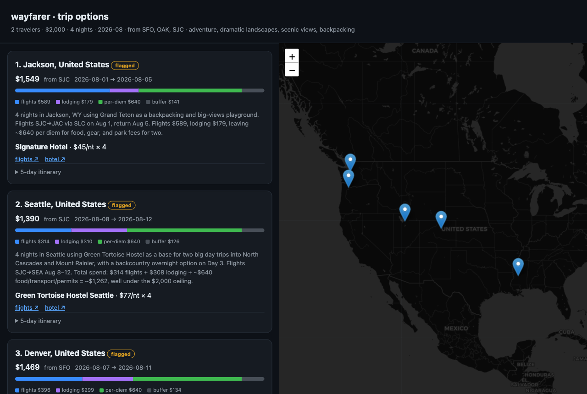

# 🧭 wayfarer

**An agentic, budget-bounded, plan-only trip planner.** One natural-language request in, 4–5 complete, bookable trip plans out — exact flights, exact hotels, day-by-day itineraries, budget breakdowns, and deep links. It never books anything; you click out and book each piece yourself.

[](https://github.com/sohan-shingade/wayfarer/actions/workflows/ci.yml)
[](https://www.python.org/)
[](LICENSE)
[](#why-plan-only)

> ```
> wayfarer "vacation for 2, budget 3k total, anytime in august, want insane landscapes"
> ```



Every run produces a self-contained HTML viewer (cards, budget bars, itineraries, a map pinning each hotel), plus Markdown and JSON artifacts you can save or diff.

---

## Highlights

- 💸 **Budget is a hard constraint, not a suggestion.** Every plan is assembled bottom-up (flights + lodging + per-diem + buffer) and must clear your ceiling with margin. A critic agent re-verifies the math before anything is shown.
- 🤖 **LLM at the edges, code in the middle.** Four small agents (parse → brainstorm → write → critique) wrap a fully deterministic pipeline: prune, cost, rank. Cheap, testable, reproducible.
- 🆓 **Zero API keys required to start.** Flights via [`fli`](https://pypi.org/project/flights/) (free Google Flights), hotels via the keyless [`trvl`](https://github.com/MikkoParkkola/trvl) CLI, agents on your Claude subscription.
- 🔥 **Deal detection.** Standout-cheap fares get flagged in every run for free; an opt-in `wayfarer-deals` mode hunts fares below their historical range.
- 🍜 **Taste profiles.** Ingest your Beli restaurant lists (video or screenshots → vision extraction) into per-person and group taste profiles that can flavor itineraries.
- 📁 **Everything is a file.** Runs land in `runs/<key>/` keyed by a hash of the brief — re-running the same trip overwrites in place instead of piling up copies.

## Why plan-only?

Booking means payments, PII, vendor contracts, and liability. Wayfarer deliberately stops at the research step: it finds the exact flight and the exact hotel, prices the whole trip against your budget, and hands you deep links. The last click is always yours.

## How it works

```
prompt
  → [LLM]  brief parser       structure the request, infer origin      (cheap)
  → [gate] elicit             ask: origin? long-haul? ceiling?         (pre-spend)
  → [LLM]  brainstormer       ~40 in-season, vibe-matched destinations
  → [code] coarse prune       1 flight call each, drop pricey → ~12
  → [code] cost assembly      + hotel + per-diem buffer, keep ≤ budget → ~6
  → [code] rank               vibe × headroom × season → top 5
  → [code] exact pricing      lock specific flights + hotels
  → [LLM]  itinerary writer   day-by-day plans
  → [LLM]  critic             verify sums ≤ budget, no hallucinations
  → present                   ranked plans + booking deep links
```

Only four nodes are LLM calls — the two ends. The spine is deterministic code on purpose: cheaper, testable, and it won't melt a flight provider's rate limit. Hard caps in `config.py` (max provider calls, concurrency, survivors) bound both spend and API pressure.

```
src/wayfarer/
├── orchestrator.py      the deterministic state machine
├── cli.py               entry points (wayfarer, wayfarer-deals, wayfarer-beli)
├── models.py            typed contracts between every stage
├── agents/
│   ├── runtime.py       claude -p wrapper: env scrub + billing guard
│   ├── llm_agents.py    the four agents
│   └── prompts/*.md     their prompts + JSON contracts
├── engine/              coarse prune, cost assembly, rank, budget, taste, deals
└── providers/           swappable adapters behind base.py interfaces
```

## Quickstart

```bash
# 1. Claude Code, logged in with a Pro/Max subscription (NOT an API key)
npm install -g @anthropic-ai/claude-code
claude login

# 2. Install
git clone https://github.com/sohan-shingade/wayfarer && cd wayfarer
uv venv && source .venv/bin/activate
uv pip install -e ".[dev]"

# 3. (Optional but recommended) keyless hotel data
go install github.com/MikkoParkkola/trvl/cmd/trvl@latest
#   or: brew install MikkoParkkola/tap/trvl

# 4. Confirm you're on subscription auth, not API billing
./scripts/preflight.sh

# 5. Plan a trip
wayfarer "vacation for 2, budget 3k total, anytime in august, want insane landscapes"
```

Structured flags override the parsed brief; multi-origin checks every airport and keeps the cheapest:

```bash
wayfarer "adventurous, insane landscapes, backpacking" \
  --pax 2 --budget 2000 --month 2026-08 --nights 4 --origins SFO,OAK,SJC --open
```

`--open` launches the HTML viewer when the run finishes.

### Providers

| Layer   | Default                            | Alternatives                                    |
|---------|------------------------------------|-------------------------------------------------|
| Flights | `fli` — free Google Flights, no key | SerpApi `google_flights` (needs `SERPAPI_API_KEY`) |
| Hotels  | `trvl` — free, keyless CLI          | SerpApi `google_hotels` → labeled flat-rate estimate |
| Agents  | `claude -p` on your subscription    | implement `AgentRuntime` for API-key billing     |

Hotel preference is `trvl` → SerpApi → flat estimate; force one with `WAYFARER_HOTELS=trvl|serpapi|flat`. One SerpApi key (free tier ~250 searches/mo) powers both engines — copy `.env.example` to `.env` and set `SERPAPI_API_KEY` if you want it. (`trvl` is PolyForm Noncommercial — fine for personal, plan-only use.)

Provider responses are cached in a local SQLite DB (`~/.cache/wayfarer/providers.db`) with a TTL, so identical requests reproduce the same flight and hotel data. Force fresh data with `WAYFARER_CACHE=off`.

## ⚠️ Billing: read this before your first run

The agents shell out to `claude -p`, which runs on your **Claude Pro/Max subscription** — not per-token API billing. Two guards keep it that way:

- The runtime **strips `ANTHROPIC_API_KEY`, `ANTHROPIC_AUTH_TOKEN`, and `ANTHROPIC_BASE_URL`** from every agent subprocess. If a key were set, the CLI would silently bill your API account instead.
- There have been reports of `claude -p` billing as API usage even with no key set, so the runtime also reads `total_cost_usd` from every result and **aborts the run if it is positive** (`fail_on_api_billing=True`).

Before real use, run `scripts/preflight.sh` and check `/status` inside an interactive `claude` session — the Auth token field should read `CLAUDE_CODE_OAUTH_TOKEN`. Watch your dashboards on the first runs.

**ToS note:** running `claude -p` on your own subscription for your own local use is fine. Subscription OAuth may **not** power a product served to other people — if you productize this, swap `ClaudeCLIRuntime` for an API-key runtime (the `AgentRuntime` interface exists for exactly that).

## Run artifacts

Each run is saved to `runs/<month>_<vibe>_<pax>pax_<hash>/` (local only, gitignored):

- `run.json` — the structured brief + metadata
- `summary.md` — ranked index of all options
- `plan-NN-<dest>.{json,md}` — each trip as a saveable file
- `index.html` — the self-contained visual viewer (Leaflet map, budget bars, itineraries)

## Deal detection

- **Relative (free, always on):** within a normal run, any fare ≤65% of the median gets tagged `🔥 deal` in the output, summary, and viewer. No extra API calls.
- **Absolute (opt-in):** `wayfarer-deals` scans aspirational destinations from your origins for fares below their typical historical range (SerpApi `price_insights`) — real error-fare hunting. It spends metered quota, so it's **off by default**:

  ```bash
  wayfarer-deals --origins SFO,OAK --month 2026-10 --nights 7 --enable
  ```

  A hard cap (`deal_hunt_max_calls`, default 24) clamps `targets × origins` so a scan can't blow your quota. Results save to `runs/deals_*/`.

## Beli taste profiles

Turn your [Beli](https://beliapp.com/) restaurant lists into a taste profile that can flavor trip planning. Record a slow scroll of a list (or grab screenshots); a vision agent extracts places and cuisine tags, deduplicates, and scores them by your rating pattern.

```bash
# ingest your "been" list from a screen recording
wayfarer-beli alice --video recordings/beli_been.mov --list-type been
# alice: 47 places -> 12 cuisines, 0 on wishlist
# wrote profiles/alice/beli_snapshot.json + taste.json

# second pass for the wishlist — appends to the same snapshot, dedup handles overlap
wayfarer-beli alice --video recordings/beli_wants.mov --list-type want_to_try

# screenshots instead of video
wayfarer-beli alice --shots shots/ --list-type been

# merge profiles into a group (consensus scores, shared wants, union of dislikes)
wayfarer-beli group --merge alice,bob,charlie
```

Profiles land in `profiles/` (local only, gitignored). Video ingestion needs the `ffmpeg` system binary; scroll slowly with brief pauses so mpdecimate can dedupe frames.

## Testing

Two tiers:

```bash
pytest          # FAST: offline, no network or claude. Deterministic logic + provider
                # parsers run against recorded real responses in tests/fixtures/.
pytest -m live  # LIVE: genuine end-to-end (real fli + SerpApi + claude -p). Skips
                # unless creds + network are present; keep ANTHROPIC_API_KEY unset.
```

Regenerate fixtures with `python scripts/record_fixtures.py` (needs creds + network).

## Contributing

PRs welcome. Ground rules (see `CLAUDE.md` for the full contributor context):

- **Plan-only, forever.** No booking, payments, or PII capture.
- **Keep the spine deterministic.** LLM calls belong in `agents/` only.
- **Vendor isolation.** Concrete providers stay behind the `providers/base.py` interfaces.
- **Don't raise the caps quietly.** The limits in `config.py` protect rate limits and spend.
- Add tests next to new engine logic; `pytest` must pass offline with no credentials.

## License

[MIT](LICENSE). The optional `trvl` hotel binary is separately licensed (PolyForm Noncommercial) and is not distributed with this project.
